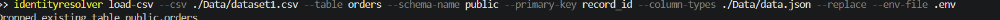
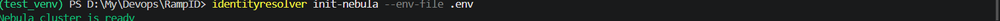
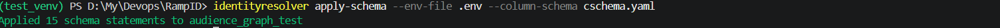
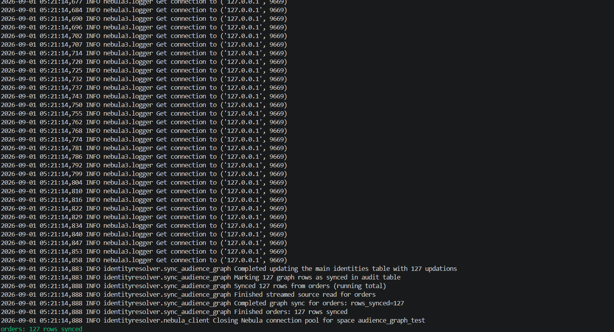
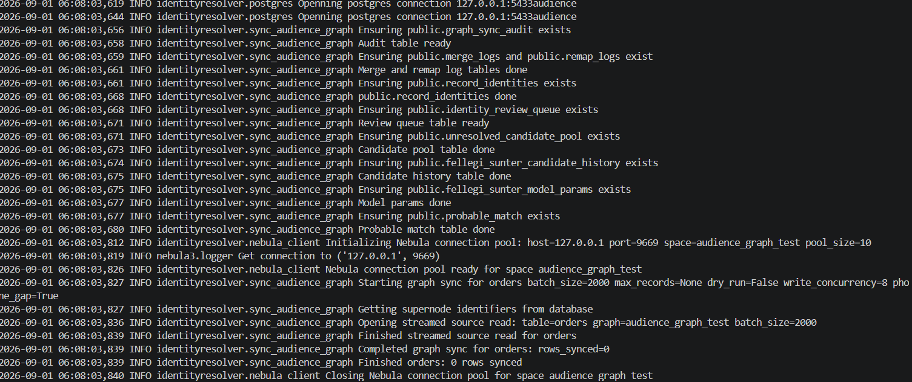
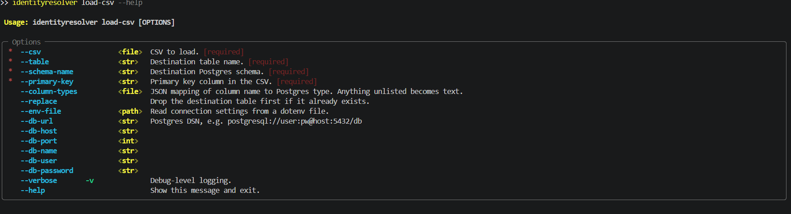
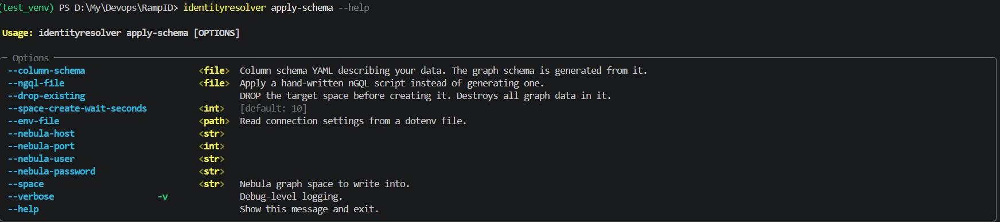

# Identity Resolution
## Motivation
So for the past whole year I have been making websites, android apps as projects, I even went into abit of games but that did not feel like complex like as I love math so something that gets my mind to think rather than just structing endpoints, sending requests update ui. I personally hate making UI so I came accross rampid. I researched and found about id5, uid2 like I got to read about this identity resolution thing and I was surprised, I also read articles and I found it exciting so I decided to develop something like that. At first it was very difficult as this was all confusing to me, where to start how to and like what am I even making and how to see those result like when u do background color: red in css. Well I took my own website's data, researched and found about nebula, took help of AI to set up nebula and then started developing on my own, first I created a simple deteministic as they say in this field graph only and then I worked towards probability, the fellegi sunter model and I had to revise my probability lessons as it was just probability in m an u, m being the probability that given this is true, the two records are same and u is given this is false these two records are separate. So I took cookies data and used it in it, like at first the results were not good, but eventually it got good. Like I still was unsure about how to assign this to m and that to u, and seeing results of changing those m and u. It made a whole difference. That's when I came across the other idea of making the probabilities good over time by using active learning, that is still very much work in progress but I have tested with some tests and I think that would be the next major update when I successfully run it. And in middle of this, I also learned about mean and variance as to calculate a super node, I really wanted to cite that research paper but I lost it, it was some chinese paper that introduced me to that concept of calculating super node using z score of each node after fitting a heavy tailed degree distribution and then flagging outliers. **I think my main motivation was of creating this when all other big tech of this exist was that they score by focusing alot on fuzzy matching. But in this no fuzzy matching, everything is matched as is to be as deterministic as possible even while adding probabilistic touch, which all depends on the specified model probabilities**
## Tech Stack
Everything is done in **Python**. Docker compose is used to setup a cluster containing nebula studio, nebula graph db, postgresql db, postgres admin. Psycopg2 and nebula3 were used to interact with postgres db and nebula db. Numpy is used in probability and active learning to use np array and perform operations as the number of features can be greater than 1 so putting those in an numpy aray.
## Journey and Learning
The journey at the beginning of project was difficult as I was learning and then it got fine as I could also see results, test and everything. And I think the difficult part was joining the parts that I already knew to make this. Like except graph database, every operation I knew it but maybe at a smaller level. Like probabilities, mean, variance, union find, writing test, I knew all of that separately and maybe at a smaller level but then combining all of those concepts into making these, I had to research and read which is I hate, so that way of thinking like going deep somewhat. Ig what I want to say is this project helped me to learn how to research in a nutshell.
## Setup
There is a docker compose file and requirements.txt in repository's root. You need to have python and docker(for real data setup only) installed to be able to run the project.
### Demo Running
- First of all clone the repository 
```bash
git clone https://github.com/mohammad-ans/ID-Graph.git
```
- And then navigate to the repo using
```cd ID-Graph```
- And then install the requirements
```pip install -r requirements.txt```
- And then for the next step, if you want to run the demo, you need to have bash installed. If you are in windows, you can run it in git bash or wsl ubuntu. Run it like this
```bash
bash shell.sh
```
This will run the tests and a demo on the demo data.
### Run on a cluster with real Data
This step is also considering that you are in the repository folder as you need the compose file and datasets.
- Set up docker cluster.
```
docker compose up -d
```
Run it twice, and then wait for 20s as the pgadmin takes some time to start.
- Install package
```bash
pip install identityresolver-dev
```
- And then first you need to load data in the postgres container using the cli as
```
identityresolver load-csv --csv ./Data/dataset1.csv --table orders --schema-name public --primary-key record_id --column-types ./Data/data.json --replace --env-file .env
```
--csv option specifies the csv file to be loaded. In the repository there are two datasets. dataset1 and dataset2. If you want to add your own dataset, make sure it has a **primary key** and specify that in --primary-key instead of record_id and **source_table** column.
--table specifies the table to be added the data inside. It **drops** the table first so all data inside it is removed. If you want to change that, you can comment the drop line in the loadcsv.py file
--schema-name is just the name of postgres schema in which all data is stored, you can skip that as it is stored in the .env file too to make it consistent accross everything.
--column-types is a json file that specifies the postgres datatype of columns, by default it is written as text
--primary-key is the primary key field in the csv table.
--env-file is the .env file which has default values and passwords for the cluster setted up.

- Now you have to initialize the nebula schema
```
    identityresolver init-nebula --env-file .env
```
Make sure it says initialization complete otherwise rerun the command.
- Run apply schema
```
    identityresolver apply-schema --env-file .env --column-schema cschema.yaml
```
Here the end cschema file is for the datasets1 and datasets2. If you want to add your dataset you would have to change the schema file or create a new file and provide it.
- Now you can run the main sync
```
    identityresolver sync --env-file=.env --tables=orders --column-schema=cschema.yaml --schema-name=public
```
--table for the postgres table in which data is stored. You can also specifiy more than one tables here
--column-schema is the schema file
--schema-name is the postgres schema name in which tables are stored and new tables for logs, audit, review queues, and the final identity table.
--phone-gap specifies if you want to track phone gap, you can edit the phone gap's value in graph_model file. Phone gap specifies after how many days two records phone are said to be unrelated
--sync-table is the name of the audit table
--dry-run is an option that you can specify to dry run instead of writing back anything to nebula or postgres. Like this:
```
    identityresolver sync --env-file=.env --tables=orders --column-schema=cschema.yaml --schema-name=public --dry-run
```
These were the main options. Other options for modifying the behaviour are
--batch-size the number of rows to be processed in the identity resolution pipeline at a time.
--max-identifiers specifies the max amount of identifiers an identity can have before it is remaped strict using pair union find
--remap-type specifies when identity is broken during strict remapping, what happens to identifier if they coexist in more than one cluster. 1(default) specifies to attach it randomly to whichever appears first while iterating. 2 specifies attach it to the cluster in which it occurs the most. 3 is to mark it invalid and consider it invalid if it appears later anywhere by saving it to the database.
--max-records specify the max records to process in a single run. If a table has more unprocessed rows than this, it is capped at max records.
--max-transactions checks the database for any identifier that exists in more than max transaction rows and marks it invalid.

 **You can see additional options by typing --help in front of any command**

If you do not want to pass these extra fields, defaults have been given in .env file and they are read from there, and you can modify there too without having to specify everything at run time. But runtime argument has priority over .env.

After batch has ran successfully, you can open your browser. If the docker containers are running in your local machine. Go to url 
```http://localhost:7001```
This opens the nebula studio interface. Add graphd as ip, 9669 as port, root as username, nebula as password if you did not modify anything in .env of docker compose file. This will open the studio interface. You can go to schemas page for seeing the schema or console page for running nebula queries. In the cschema, I checked pre_hashed to true even though they are not, just to make sure querying things are easier. You can use this example query
```
GO FROM "email:stephaniewatson@yahoo.com" OVER has_email REVERSELY YIELD dst(edge) AS record_name, src(edge) AS identifier; 
```
It will show two records belonging to the email which you can verify in dataset. You can run any query there to verify or even change this to some other email.


To see the postgres results if you ran full sync(no dry run), go to link on your local machine
 ```http://localhost:5050```
that will demand email and password. Defaults specified in docker compose file are
email: admin@rampid.com
password: admin
After that you need to add a server, click on add new server option. Add a random name. And then click connection and fill in the following details
host name: postgres
port: 5432
username: postgres
password: postgres
IF you changed .env or docker compose, you would have to apply those changes here too, otherwise defaults will work.
Now server is loaded, you can navigate inside server to databases, then to database name(default is audience), then to schemas and then to public(schema name) tables. You will see the tables there. You can use sql query tool there to inspect any records. If you are running the default dataset, you can right click on **record_identities** table and select query tool and run query like this
```
SELECT * FROM record_identities WHERE record_id = '888' OR record_id = '44';
```
Where 888 and 44 were just an example taken, you can take group of any two rows marked as duplicate in duplicates file to see they share same identity.

- review.py file fetches any review candidates from postgres review queue and prompts user to mark them merge or reject.
### Set up your own data
You can leave the step of loading data, and in .env provide all the details for your postgres connection, schema name, host, user, password, tables and then it would use your postgres.
You can delete the postgres containers in docker compose entirely or let them be, as there is no need for it now.
## Structure of repository
```/Data/``` folder contains two datasets for loading in postgres for testing purposes.
```/identityresolver/src/``` is the core folder having all the core files containing algorithms, schema, nebula client
```/demo``` is the folder containing a demo run, demo dataset
```/testing``` contains the python tests to ensure that nothing is broken. Those are not very strong but they can detect most of the errors in main funciton especially if u change structure of any function.
The main root contains the docker compose file, shell.sh to run tests and the demo run.
## Core Logic
The main logic in simple words goes like this. So you have some data, preferably transactions data and you want to identify which transactions were done by a same person, it is mostly useful in betting platforms where user's often change credentials, have multiple accounts so you can have better analysis that these are actually same person or identity.
You take your data in database and insert it in pipeline. The pipeline then processes data in batches if it is larger than single batch size. It structures data in a dict like structure, specifying the identifiers, signal columns and record_id. All of this configuration is specified in the schema file, be sure to change it if you have a different data. It clusters them using root level union find in memory and find any invalid identifiers and does not include those in clusters. Those clusters are taken and processed to see for phone gap and match with previous data if it exists in the graph database. It fetches the data, and makes a giant cluster of related data. And then if it does not cross the max identifiers threshold then new rows are attached to the cluster they match in graph, if they exceed the threshold they are remapped strict using pair union find that is two records are said to be together if they share atleast an identifer and a signal, or more than one identifiers with each other, this goes for the existing records in graph database. After successfully assigning each identifier an identity they are written back to postgres adding record_id with an identity.
The active learning resolver takes the unresolved records and runs them through fellegi sunter model if no active learning model is trained yet and scores them. If they pass the merging threshold they are merged, if review threshold passed they are pushed to review queue in postgres database to be reviewed by an actual person, which are handled by review.py file. The fellegi sunter model is based on a simple principle of m and u probabilities. The m and u probabilities for signal fields are also specified in the schema file. M is the probability that two records are same if they match this signal, and u is that if they do no match this signal they are separate records. Just baysean probabilities in simple form, given a whats the probability b is true, so m is P(given the two records have this same signal| They are same record) and opposite for u. Records with this probability merges are given probable_match edge in graph and in database they are marked as resolved probabilistically instead of deterministic.
The super node are identified by default know invalid identifiers, max identifiers threshold, max transactions threshold and the super node anamoly scorer that uses identifier growth over time, its bursts and how spread it is over the batches(shanon entropy function) to calculate z score which is calculated from previous identities average and deviation, and then z score value tells if identifier is invalid. Unusually high is invalid, by default it is 3. If it is found to be anomalous it is remapped strictly.
## Still in progress
The active learning is still in progress like I myself have not any specific guides yet on how to train the model on basis of data but if we take the code side and current data sets, it works fine for them.
Testing cannot still be fully relied on as I did not write tests about postgres and nebula queries so they still fail if I tweak some changes and find those errors in real running.
The blocking of candidates into probabilistic pairs is done on basis of country and transaction date which fails for other schema so that is **not implemented.**
Specifying db url in options does not works yet.
### AI Usage
AI was used in beginning to help me setup nebula and then afterwards in my demo run to generate data, I provided the conditions and it just generated the data that met those conditions. It was used for debugging and I took its help in researching, like understanding other's work. I also took its helping in learning yaml and docker compose structure but I applied it myself. AI was also used to generate the license document and as a helping tool in creating pypi release of the package that is everything was already there, it just helped to restructure in it.
## Images







